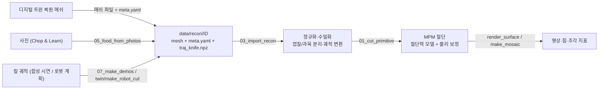

# 자르기 시뮬레이션 (Genesis MPM)

칼로 식재료를 자르는 태스크를 학습·테스트하기 위한 시뮬레이션 환경이다. 식재료는 Genesis World 의 MPM(재료를 수천~수만
개 입자와 격자로 계산하는 방법), 칼은 강체로 만들어 **칼이 재료를 실제로 누르고 썰어야 잘린다.** 칼이 닿으면 미리 잘라 둔
메쉬로 바꿔 끼우는 방식이 아니다. 외부에서 받은 식재료 3D 메쉬와 칼 궤적을 넣으면 단위·좌표를 맞추고 보정한 뒤 잘라서,
실제 물체처럼 그린 영상과 힘·조각 지표를 만든다.

| 테스트 결과 | 내용 | 대표 영상 |
|---|---|---|
| [reports/08_realistic](reports/08_realistic/README.md) | 사진으로 만든 오이를 사람처럼 4번 썰기(합성 칼 궤적), 물리 보정 + 실제 물체처럼 렌더 | `TR_cucumber_slices/mosaic_render.mp4` |
| [reports/09_elrobot_twin](reports/09_elrobot_twin/README.md) | 디지털 트윈 복원 물체를 시뮬레이션에 올려 자르기, ElRobot 이 칼을 쥐고 복원 당근 썰기 | `robot_cut/TR_robot_carrot/kitchen_render/mosaic.mp4` |

## 흐름 한눈에



## 설치

Linux + NVIDIA GPU 에서 확인했다(RTX 5060 Laptop 8GB, PyTorch 2.11 cu128, Genesis 1.4.3). 명령은 모두 이 `sim/` 폴더에서 실행한다.

```bash
conda create -n cutsim python=3.11 -y && conda activate cutsim
bash scripts/setup_env.sh          # torch(cu128) → requirements.txt → Genesis 패치
python scripts/00_smoke_test.py    # GPU 연산·헤드리스 렌더·MPM 완주 확인 → reports/00_smoke/
```

- **Genesis 패치가 꼭 필요하다**(4장 표). `setup_env.sh` 가 설치된 genesis-world 1.4.3 소스(site-packages)를 직접 고친다.
  고친 내용은 `patches/genesis_1.4.3_multifield.diff`, 되돌리기는 `pip install --force-reinstall --no-deps genesis-world==1.4.3`.
  패치 기능을 모두 끄면 원래 Genesis 와 결과가 같다. Genesis 버전을 올리면 패치가 맞는지부터 다시 확인해야 한다.
- 그래프·영상 글자에 한글 폰트(NanumGothic 또는 Noto Sans CJK)가 있으면 쓴다.

## 1. 데이터 받기 (입력 규약)

시뮬레이션 입력은 물체 하나당 폴더 하나다(`data/` 는 git 에서 뺀다).

```text
data/recon/<object_id>/
  mesh.obj | mesh.ply | mesh.glb   필수. 식재료 겉면 메쉬. 구멍·손 조각이 있어도 된다(임포트가 처리)
  meta.yaml                        필수. 아래 키
  traj_knife.npz                   선택. 칼 궤적: t (N,) s, T_world_knife (N,4,4), fps
```

| meta.yaml 키 | 뜻 |
|---|---|
| `object_id`, `source` | 이름, 출처 |
| `category` | 물성 키(`configs/materials.yaml`: cucumber, apple, potato, default) |
| `units` | `m` / `cm` / `mm` |
| `up_axis` | `z` / `y` (ARKit 세계 좌표처럼 y 가 위면 `y`) |
| `frame` | `object` / `world`. `world` 면 `T_world_object`(원본 단위 기준 4×4)도 준다 |
| 선택 | `color_skin`·`color_flesh`(0~1 RGB, 단면 색), `hold_box`(다른 손이 쥐는 자리, 아래 3장), `scale_checked`(실물 치수와 비교했는지), `task`(영상 제목) |

**칼 자세 규약**: `T_world_knife` 의 원점 = 날 끝 한가운데, x = 칼날 면 법선, y = 칼날 길이 방향, z = 날 끝 → 칼등.
데이터의 칼 모델 좌표가 이와 다르면 고정 변환을 곱해서 넣는다. 궤적은 메쉬와 같은 좌표계여야 한다.

지금까지 쓴 출처:

| 출처 | 주는 것 | 넣는 방법 |
|---|---|---|
| 디지털 트윈 복원(이 저장소 `camera/recon.py`) | 물체별 복원 메쉬 | 가상 카메라로 찍은 가상 주방을 복원 코드로 다시 만든 것만 시험했다(`scripts/twin/recon_kitchen.py`, 09 결과). 복원 코드는 메쉬를 파일로 저장하지 않고 HTTP(`/recon_objects`)로만 내보내므로, 실제 iPhone 캡처를 쓰려면 물체별 메쉬를 파일(ply/obj + 물체 이름)로 저장하거나 촬영 키프레임을 남겨야 한다. ARKit 세계 좌표 그대로면 `units: m`, `up_axis: y` |
| 사진(Chop & Learn) | 오이·사과·감자 모양, 껍질·과육 색 | `05_food_from_photos.py`: 위에서 찍은 통째 사진 실루엣 → 3D, 썬 사진 → 색. 3D·카메라 보정이 없어 크기는 가정 |
| 칼 궤적 | 사람·로봇이 칼을 움직인 경로 | 실측 사람 궤적은 아직 없다. `07_make_demos.py` 가 사람 동작을 흉내 낸 합성 궤적(학습용 아님, 시험용)을, `scripts/twin/make_robot_cut.py` 가 로봇 칼질 궤적을 만든다 |
| DiSECt 절단 힘 곡선 | 오이·사과·감자를 칼로 누를 때의 힘 | `04_fit_cut_force.py` 로 절단 저항 계수를 맞춰 `materials.yaml` 에 적는다(4장) |

## 2. 받은 물체 보정 (`scripts/03_import_recon.py`)

```bash
python scripts/03_import_recon.py data/recon/<id>     # 검증·정규화만(GPU 안 씀) → reports/03_import/<id>/report.png 확인
```

1. **단위·축 맞추기**: m, z-up, 물체 바닥 중심을 원점으로. 같은 변환을 칼 궤적에도 적용한다.
2. **정리**: 가장 큰 연결 성분만 남겨 손·테이블 조각을 떼고, 법선을 맞추고 작은 구멍을 메운다.
3. **수밀화**: 그래도 닫히지 않으면 1mm 복셀로 다시 만든다(winding number 로 안팎 판정이라 구멍 난 메쉬도 속이 찬다).
4. **크기 검사**: 2~30cm 를 벗어나면 단위 오류 경고. 정답 메쉬가 있으면 `--ref_mesh` 로 Chamfer 거리·크기 비율 채점.
5. **껍질·과육 분리**: 과육 = 메쉬를 껍질 두께만큼 침식, 껍질 = 겉 메쉬 − 과육. 껍질은 입자보다 얇게 못 만들어 최소 입자 크기(격자 256 에서 2.5mm)로 올린다.
6. **칼 궤적**: 정규화 좌표로 옮기고 1ms 간격으로 보간(`traj_sim.npz`).
7. **복원 메쉬 다듬기**(필요할 때): 복원 겉면의 작은 돌기·주름이 입자 크기와 비슷하면 입자를 채울 때 몸통과 안 이어진 작은
   덩어리가 생겨 자르기 전부터 흩어진다. Taubin 다듬기 3번 + 부피 되돌림(`scripts/twin/meshfix.py`)으로 없앤다.
   확인은 `scripts/twin/particle_check.py`(복원 당근: 흩어진 입자 45개 → 0개).

## 3. 장면 구성 (`cutsim/scene/build.py`, `configs/`)

| 요소 | 구성 |
|---|---|
| 식재료 | MPM 탄소성(von Mises) 물체 두 개 = 껍질 + 과육. 물성은 `materials.yaml`(과육 E·ν·ρ 는 DiSECt 값, 항복응력·껍질은 가정). 격자 256(칸 3.9mm), 입자 2.5mm. 사진 오이 반 토막이면 입자 약 7,700개 |
| 칼 | 강체 칼날: 곧은 날, 쐐기 단면(등 1.5mm, 날 끝 0.2mm, 베벨 6mm, 높이 35mm, 길이는 물체 폭 + 4cm 이상). 바닥에 고정된 지그(x·y·z 직선 + 수직축 회전, 4자유도, PD 위치 제어)가 움직인다. 궤적은 날 끝 위치와 수평 방위만 따라가고 칼 기울기는 버린다 |
| 도마 | 바닥 평면(z=0) |
| 다른 손 | `hold_box` 상자 바닥 면적 안의 재료 입자를 입자 구속으로 붙잡는다(`--grip`). 상자는 보이기만 한다 |
| 시간 | 제어·기록 1ms, 내부 서브스텝은 가장 단단한 재료 기준 CFL 로 자동(오이 124분할) |

## 4. 현실감 있게 자르기

1. **칼이 재료를 실제로 가른다.** MPM 의 CPIC(칼 표면 양쪽 재료를 따로 다루는 접촉 방식)로 칼날이 재료 사이를 지나간다.
   절단면을 미리 정하지 않는다.
2. **잘린 조각이 다시 붙지 않게 한다**(패치 1단계). MPM 은 가까운 입자끼리 격자를 같이 써서, 칼을 뺀 뒤 격자 1~2칸 안의 두
   조각이 한 덩어리처럼 끌려간다. 날 끝이 도마에 닿는 순간(궤적 재생은 획마다) 칼날 면 기준으로 입자에 조각 라벨(짝/홀)을
   붙이고 라벨별로 격자를 따로 써서, 서로 파고들 때만 부딪치게 한다. 자르고 한쪽 조각만 밀 때 반대쪽이 따라오는 비율
   0.89 → 0.003.
3. **칼에 걸리는 힘은 별도 모델이 맡는다.** 칼날(1.5mm)이 격자 칸(3.9mm)보다 얇아, MPM 이 주는 칼 힘은 칼이 격자점 위에
   있느냐 사이에 있느냐에 따라 0.1~11N 으로 들쭉날쭉하다(격자를 3배 촘촘히 해도 2.3배 차이, 한 번에 31분). 그래서 MPM 은
   모양·분리만 맡기고, 절단 저항 F = G_c·L + τ·A 를 칼에 건다(`cutsim/control/cut_force.py`, `--cut_force`).
   L = 칼날 끝 중 바로 앞에 재료가 있는 길이, A = 칼 옆면이 재료에 잠긴 면적(매 2스텝 입자 위치로 잰다). 힘은 칼의 면내
   속도 반대 방향이고, 톱질하면 수직 성분이 1/(1+ξ²) 로 준다(ξ = 칼날 방향 속도 / 들어가는 속도).
   계수는 DiSECt 힘 곡선에 맞췄다: 오이 G_c 351 N/m·τ 5,064 Pa(오차 12%), 사과 251·10,494(8%), 감자 312·4,717(12%).
   시뮬레이션 안에서도 칼 위치와 무관하게 재현된다(오이 50.5N 대 51.0N, DiSECt 46.4N).
4. **누르는 힘에 한계를 줄 수 있다**(`--z_force_budget N`). 명령 동작에 필요한 수직력이 예산보다 크면 칼을 더 내리지 않고
   톱질은 계속한다. 예산 12N 에서 사진 오이를 누르기만 하면 4.9mm 에서 멈추고, 톱질하면 도마까지 잘린다.
5. **격자 때문에 생기는 부작용을 보정한다**(`scripts/run_realistic.sh` 의 네 옵션).

   | 옵션 | 막는 것 | 효과(오이 4번 썰기) |
   |---|---|---|
   | `--grip` (+ `hold_box`) | 칼이 격자 한 칸 폭으로 재료를 밀어 남은 몸통이 칼질마다 밀림 | 몸통 이동 8.8 → 0mm |
   | `--set board.collision_offset_dx=1` | 떨어진 조각이 도마 면 격자점 영향권 위에서 멈춰 떠 있음 | 조각 바닥 높이 4.7~5.0 → 0.55~1.05mm |
   | `--mf_fill 0.75` (패치 4단계) | 입자가 격자점 1.5칸까지 질량을 나눠 11.7mm 떨어진 조각끼리 밀어 넘어뜨림 | 꽉 찬 격자점에서만 조각 사이 접촉 |
   | `--sep_damp 300 --sep_damp_r 0.015` (패치 5단계) | 칼이 넓게 밀어 쌓인 탄성이 잘리는 순간·칼을 뺄 때 풀려 조각이 튐 | 라벨 순간부터 칼이 빠질 때까지 칼날 15mm 안의 조각과 거기 맞닿은 조각 전체를 서브스텝마다 감쇠. 잘리는 순간 튕김 없음. 떨어져 넘어지는 조각은 그대로 |

6. **실제 물체처럼 다시 그린다**(`scripts/render_surface.py`, 물리는 그대로 두고 끝난 뒤 그림). Genesis 는 입자를 공으로
   그린다. 처음 메쉬를 칼질 평면으로 미리 나누고(라벨이 뒤집힌 입자로 어느 조각을 나눌지 정함) 조각마다 그 조각 입자의
   움직임(강체 맞춤 + 남는 변형 보간)으로 옮긴다. 단면이 평평하고 모서리가 날카롭다. 껍질 돌기·광택, 단면 과육·씨 질감,
   칼 손잡이·손·나무 도마(보이기만 함)를 Open3D PBR 로 그린다.

**Genesis 패치 5단계** (`patches/make_genesis_multifield.py`, 모두 끄면 원래 Genesis 와 같음)

| 단계 | 켜는 법 | 하는 일 |
|---|---|---|
| 1 조각 라벨 | `--multifield` | 라벨별 격자 두 개, 서로 파고드는 상대속도만 없애는 접촉 |
| 2 칼 안쪽 격자점 분리 | `--inside_sep` | 칼 정중앙 격자점의 좌우 비대칭을 없앰. 조각을 1~3cm 밀어내 데이터 생성에서는 끈다 |
| 3 렌더 KD-tree | 항상 | 복원 메쉬 + 입자 4만 개에서 메모리 50GB 로 죽던 것 → 2.1GB |
| 4 꽉 찬 격자점 접촉 | `--mf_fill` | 위 표 |
| 5 입자별 감쇠 | `--sep_damp` | 속도와 APIC 회전(C)을 서브스텝마다 함께 감쇠 |

## 5. 실행

```bash
# 받은 폴더를 정규화하고 자르기: 궤적이 있으면 재생(TR), 없으면 가운데를 한 번 누르기(T1)
python scripts/03_import_recon.py data/recon/<id> --cut --cut_args "--cut_force --no_baseline \
    --grip --set board.collision_offset_dx=1 --mf_fill 0.75 --sep_damp 300 --sep_damp_r 0.015 --save_frames 25"
# 결과 reports/01_cut/{TR|T1}_import_<id>/ → 실제 물체처럼 다시 그리기 + 카메라 4대·힘 그래프 한 영상
python scripts/render_surface.py reports/01_cut/TR_import_<id>
python scripts/make_mosaic.py reports/01_cut/TR_import_<id> --src render
```

`01_cut_primitive.py` 주요 옵션(03 의 `--cut` 이 `--multifield`, 껍질·과육 두 층, 격자 256 을 넣어 부른다):

| 옵션 | 뜻 |
|---|---|
| `--test T1 / T2 / TR` | 수직 누르기 / 톱질하며 내리기 / 칼 궤적 재생(`--knife_traj traj_sim.npz`) |
| `--cut_force`, `--z_force_budget 12` | 절단 저항 모델, 누르는 힘 예산(N) |
| `--grip`, `--hold_box cx,cy,cz,sx,sy,sz` | 다른 손(m, 정규화 좌표). `meta.yaml` 의 `hold_box` 로도 준다 |
| `--mf_fill`, `--sep_damp`, `--sep_damp_r`, `--set board.collision_offset_dx=1` | 4장 보정 |
| `--save_frames 25` | 입자 위치·조각 라벨·칼 자세를 `frames.npz` 로(렌더 입력) |
| `--set mpm.grid_density=384` | 격자 384(칸 2.6mm). 얇게 썰 때 부스러짐이 줄지만 몇 배 느리다 |
| `--domain_pad 0.02` | 조각이 넘어지며 멀리 갈 때 계산 영역 여유(m) |
| `--no_baseline` | 재료 없는 빈 동작 기준선(칼 PD 관성 힘, 1N 미만) 빼기를 건너뜀 |

결과 폴더: `metrics.json`(관통, 획별 힘, 부피 변화, 연결 성분), `force_depth.png`, 카메라별 `persp/side/top/face.mp4`.
시간: 오이 4번 썰기(7.4초 분량) 약 7분 + 렌더 약 1분. **GPU 하나에 실행을 여러 개 동시에 돌리면 한 개당 4배 넘게 느려진다** — 차례로 돌린다.

## 6. 파일 구성

```text
configs/   materials.yaml(식재료 물성·색·절단 저항 계수), scene_default.yaml(격자·시간·칼·도마·카메라)
cutsim/
  io/recon_loader.py     복원 폴더 읽기·검증·정규화, 칼 궤적 변환, Chamfer 채점
  assets/volumize.py     수밀화, 껍질/과육 분리     assets/knife.py  칼날 메쉬·칼 지그 URDF 생성
  scene/build.py         도마·칼·식재료 장면, 조각 라벨, 손 그립, 패치 기능 켜기
  control/knife.py       누르기·톱질 궤적            control/cut_force.py  절단 저항 모델
  metrics/cut.py         관통·연결 성분·부피·힘 판정  calib/disect.py  DiSECt 힘 곡선 읽기
patches/   Genesis 패치 생성기 + diff
scripts/
  setup_env.sh, 00_smoke_test.py       설치, 환경 확인
  01_cut_primitive.py                  절단 시뮬레이션 본체(T1·T2·TR)
  03_import_recon.py                   받은 폴더 검증·정규화·분리(+ --cut 이면 01 호출)
  04_fit_cut_force.py                  절단 저항 계수를 DiSECt 곡선에 맞춤(data/disect 필요)
  05_food_from_photos.py               Chop & Learn 사진 → 식재료 폴더(data/chopnlearn/images 필요)
  07_make_demos.py                     합성 칼 궤적 시연 3개(오이 썰기·사과 4등분·감자 누르다 톱질) → data/demos
  run_realistic.sh                     합성 시연을 보정 4가지로 재생 → 렌더 → 영상(08 결과)
  render_surface.py, make_mosaic.py    실제 물체처럼 렌더, 카메라 4대 + 힘 그래프 영상
  twin/                                09 결과용: recon_kitchen.py(이 저장소 복원 코드로 가상 주방 복원),
                                       meshfix.py, particle_check.py, robot_kin.py(ElRobot FK/IK),
                                       make_robot_cut.py(로봇 칼질 궤적·쥐기), render_kitchen_cut.py(주방 + 로봇 렌더)
reports/   08_realistic, 09_elrobot_twin (영상·설명. 입자 기록·메쉬 같은 큰 중간 파일은 뺐다)
```

## 7. 한계와 아직 확인하지 못한 것

- **칼 궤적이 실측이 아니다.** 합성 궤적과 로봇 계획 궤적만 돌렸다. 실측 사람 칼질 데이터는 아직 없다.
- **실제 iPhone 캡처 복원으로는 안 해 봤다.** 가상 카메라 영상 복원만 시험했다(잡음·가림이 적어 상한값이다).
- 칼 지그가 4자유도라 칼 기울기(합성 궤적에서 최대 5°)를 버린다. 칼 기울기까지 따라가려면 6자유도 지그가 필요하다.
- 절단 저항은 칼에만 걸리고 재료에는 걸리지 않는다(작용·반작용 불일치). 곧은 날만 다룬다(배가 휜 칼은 날 끝 곡선을 따라
  재도록 고쳐야 함). 칼이 격자 줄을 지날 때마다 남는 MPM 힘이 5~10N 씩 튄다.
- 격자 256 에서는 칼 자국이 칼 두께보다 넓고(틈 약 7mm, 칼 1.5mm), 1.2cm 두께 조각은 일부 부스러진다. 감쇠는 격자 탓에 생긴
  에너지를 없애는 보정이지 물리 모델이 아니다(칼 근처 조각은 칼이 빠질 때까지 거의 멈춰 있다).
- 조각 라벨이 두 개(짝/홀)뿐이라 교차 절단(깍둑썰기)에서 대각선 조각이 같은 라벨이 될 수 있고, 반쯤 자른 칼집은 다시 붙는다.
- 연결 성분 수는 맞닿은 조각을 하나로 세서 조각 수 판정에 그대로 못 쓴다.
- 물성: 항복응력·껍질은 가정값이다. 당근 물성이 없어 감자 값을 빌렸다. 사진 형상의 크기는 가정값이다.
- 렌더는 실시간 PBR 이라 과육의 반투명 같은 효과는 없다. 메쉬 렌더는 평면 절단만 다루고, 오이 무늬만 자세히 만들었다.
- Colab 등 다른 환경에서는 아직 안 돌려 봤다.

## 출처·라이선스

데이터(메쉬·사진·궤적)는 넣지 않았다. 식재료 형상·색을 만든 Chop & Learn 사진과 절단 저항 계수를 맞춘 DiSECt 힘 곡선은
둘 다 CC BY-NC 4.0(비상업)이다. 09 결과의 주방 물체·로봇 출처는 [reports/09_elrobot_twin](reports/09_elrobot_twin/README.md#출처) 에 있다.
