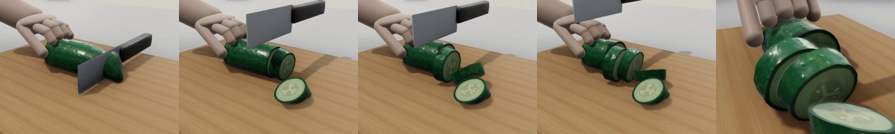

# 08 오이 4번 썰기: 물리 보정 + 실제 물체처럼 렌더

**무엇을 시험했나.** 사람이 써는 것 같은 칼 궤적으로, 다른 손이 쥐고 있는 반 토막 오이를 끝에서부터 약 1.2cm 간격으로
4번 앞뒤로 밀며 썬다. 확인한 것은 네 가지다.

1. 네 번 모두 도마까지 잘려 조각이 나뉘는가
2. 남은 몸통이 칼질마다 밀리지 않는가
3. 썬 조각이 뜨거나 튀지 않고 자연스럽게 서거나 넘어지는가
4. 입자 공 대신 실제 오이처럼 보이는가(평평한 단면, 껍질·과육·씨)



## 설정

| 항목 | 값 |
|---|---|
| 식재료 | Chop & Learn 사진 실루엣으로 만든 오이(길이 20cm 가정)의 끝쪽 절반. 껍질 2.5mm + 과육, 입자 7,688개 |
| 물성 | 과육 E 2.5MPa·ν 0.37·ρ 950kg/m³(DiSECt 오이), 항복응력 0.3MPa. 껍질은 E 5MPa·항복응력 0.9MPa(가정) |
| 칼 | 쐐기 날, 등 1.5mm, 길이 85mm |
| 칼 궤적 | 합성(실측 아님) 6.9초, 4획: 최소 저크 이동 + 앞뒤 톱질 + 손떨림(위치 0.3mm, 수평 방위 1°, 기울기 2°). 지그가 4자유도라 기울기(최대 5.2°)는 버린다 |
| 옵션 | `--multifield --cut_force --grip --set board.collision_offset_dx=1 --mf_fill 0.75 --sep_damp 300 --sep_damp_r 0.015 --save_frames 25 --domain_pad 0.02 --no_baseline`, 격자 256(칸 3.9mm) |
| 계산 | 7.4초 분량에 시뮬레이션 6.8분 + 렌더 약 1분(RTX 5060 Laptop, VRAM 1.4GB) |

## 파일

| 파일 | 내용 |
|---|---|
| `TR_cucumber_slices/mosaic_render.mp4` | **이것만 보면 된다.** 위 4칸은 카메라 4대로 실제 물체처럼 렌더한 장면, 아래는 힘 그래프 |
| `TR_cucumber_slices/mosaic.mp4` | 같은 실행을 Genesis 입자(공)로 그린 것. 물리 계산 결과 그대로라 렌더와 비교할 때 본다 |
| `TR_cucumber_slices/thumbs_render.jpg` | 렌더 장면 미리보기(진행 20·45·70·100% + 마지막 단면) |
| `TR_cucumber_slices/force_depth.png` | 왼쪽: 시간별 수직 저항과 날 끝 높이, 오른쪽: 깊이별 저항 |
| `TR_cucumber_slices/metrics.json` | 수치 전체(획별 힘, 관통, 부피, 연결 성분, 사용 옵션) |

영상은 25fps 이고 영상 1초 = 시뮬레이션 1초다. 카메라 네 대:

| 카메라 | 위치 | 볼 것 |
|---|---|---|
| persp | 비스듬히 위 | 전체 동작 |
| side | 칼날 면 정면 | 칼이 지나간 틈, 조각이 옆으로 밀리는지 |
| top | 바로 위 | 조각이 벌어지고 넘어지는 정도 |
| face | 절단면 쪽 비스듬히 위 | 단면(연두 과육, 세 갈래 씨, 짙은 껍질 테두리) |

힘 그래프: 빨강 = 칼에 걸린 수직 저항, 주황 = 절단 저항 모델 크기, 검은 점선 = 날 끝 높이, 파란 선 = 지금 시점.
렌더의 손·칼 손잡이·나무 도마는 보이기만 한다. 손이 있는 자리는 물리에서 재료 입자를 붙잡는 구속 자리다(입자 영상에서는 상자).

## 결과

| 항목 | 결과 |
|---|---|
| 관통 | 4획 모두 도마까지(날 끝 최저 0.48~0.55mm, 칼은 도마 0.5mm 위에서 멈추게 설정) |
| 조각 | 4번 모두 조각 라벨이 붙어 5조각: 손 쪽 몸통 + 끝 조각 + 썬 조각 3개. 썬 조각들이 서로 기대 있어 연결 성분은 2개(몸통 + 조각 더미)로 센다 |
| 손 아래 몸통 이동 | 0.1mm |
| 획별 최대 수직 저항 / 모델 힘 | 23.5·26.6·28.8·35.2N / 21.4·25.1·24.3·25.9N |
| 부피 변화 | −0.02% |

조각이 처음 자리에서 움직인 것(잘리는 순간 튕기는 조각은 없다. 큰 속도는 칼질 사이에 넘어질 때 나온다):

| 조각 | 이동 | 최고 속도 | 마지막 기울기 |
|---|---|---|---|
| 끝 조각 | 45mm | 233mm/s | 85°(넘어짐) |
| 두 번째 | 23mm | 137mm/s | 73°(넘어짐) |
| 세 번째 | 14mm | 73mm/s | 14° |
| 네 번째 | 19mm | 89mm/s | 11° |

영상에서 볼 것: 몸통이 손 아래 그대로 있고, 썬 조각은 서 있거나 기대거나 넘어져 몸통 옆에 모인다. 넘어진 조각은 도마에
붙어 눕고(떠 있지 않음) 단면이 평평하며 모서리가 날카롭다.

## 한계

- 칼 궤적은 합성이고 오이 크기는 가정이다.
- 감쇠 보정 때문에 칼 근처 조각은 칼이 빠질 때까지 거의 멈춰 있다(격자 탓에 생긴 에너지를 없애는 보정이지 물리 모델이 아님).
- 메쉬 렌더는 조각 안의 변형을 입자 움직임으로 보간해 그린다. 얇은 조각이 부스러지는 것은 그리지 않는다. 손은 처음 자리에 고정이다.
- 도마 충돌 면 보정(`board.collision_offset_dx=1`)은 격자 256 오이에서만 확인했다.

## 다시 만들기

```bash
# Chop & Learn 이미지(https://chopnlearn.github.io, CC BY-NC 4.0)를 data/chopnlearn/images 에 푼 뒤
python scripts/05_food_from_photos.py --object cucumber --size_m 0.20
python scripts/05_food_from_photos.py --object apple --size_m 0.075 --height_ratio 0.85
python scripts/05_food_from_photos.py --object potato --size_m 0.10 --height_ratio 0.75
python scripts/07_make_demos.py      # 합성 시연 3개 → data/demos/
bash scripts/run_realistic.sh        # 오이 썰기 → reports/08_realistic/TR_cucumber_slices/
```

`bash scripts/run_realistic.sh apple_quarters potato_press_saw` 로 사과 4등분·감자 누르다 톱질도 같은 보정으로 돌릴 수 있지만
아직 돌려 보지 않았다(겉면 렌더는 오이 무늬만 자세하고 사과·감자는 껍질·과육 두 색).

출처: 오이 형상과 껍질·과육 색은 Chop & Learn(CC BY-NC 4.0) 사진에서 뽑았다(실루엣 → 3D, 크기는 가정).
