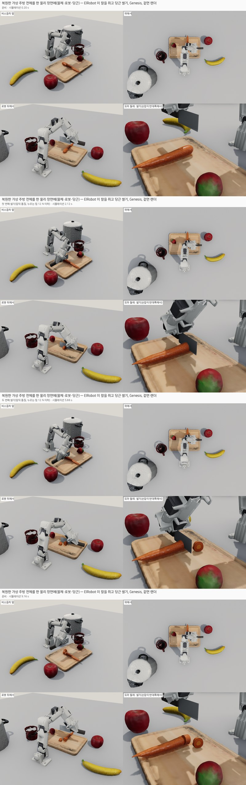

# 09 디지털 트윈 복원 물체로 자르기 + ElRobot 칼질

**목적.** 이 저장소의 디지털 트윈(iPhone LiDAR 복원) 코드가 만든 물체를 시뮬레이션에 넣어 그대로 자를 수 있는지, 그리고 복원한
주방 장면에서 ElRobot 이 칼을 쥐고 써는 장면까지 이어지는지 본다.

**전제: 가상 카메라 시험이다.** 실제 iPhone 캡처가 아니라 이 저장소의 가상 iPhone(`virtual.py`, `virtual_kitchen.py`)으로 찍은
영상을 `camera/recon.py`(수정 없이)로 복원했다. 정답 메쉬를 알아서 정확도를 잴 수 있지만, 실제 캡처보다 잡음·가림이 적으므로
결과는 상한값이다. 물체 이름은 YOLOE 인식 대신 정답 위치로 붙였다.

| 시험 | 질문 | 결과 | 파일 |
|---|---|---|---|
| A 로봇 모델 | ElRobot URDF 가 Genesis 에 올라가는가 | 올라감. 누를 수 있는 힘 추정 약 12~19N | `robot_genesis.*` |
| B 복원 품질 | 복원 메쉬가 정답과 얼마나 같고, 그대로 잘리는가 | 평균 오차 1~2mm, 복원 오이 관통·2조각 | `recon_camera_views.jpg`, `recon_vs_gt.jpg`, `cut_recon_cucumber.*` |
| C 가상 주방 | 복원 메쉬만으로 장면을 만들 수 있는가, 복원 당근·사과도 잘리는가 | 한 바퀴 복원 장면은 안정, 4개 모두 관통·2조각 | `kitchen_*`, `cut_kitchen_*` |
| D 로봇 칼질 | ElRobot 이 칼을 쥐고 복원 당근을 썰 수 있는가(로봇·주방은 그림) | 두 번 모두 도마까지, 3조각 | `robot_cut/` |
| E 주방 전체 물리 | 주방 물체·로봇까지 한 물리 장면에 넣어도 되는가 | D 와 같게 잘리고, 주변 물체는 자리 잡은 뒤 그대로 | `robot_cut_full/` |

**대표 영상**: [robot_cut_full/TR_kitchen_full/kitchen_render/mosaic.mp4](robot_cut_full/TR_kitchen_full/kitchen_render/mosaic.mp4)
(E, 주방 전체를 한 물리 장면에)



## A. 로봇 모델 (`robot_genesis.mp4`, `.jpg`)

norma-core 의 ElRobot URDF(팔 7 + 집게 1, 집게 손가락 두 개는 mimic 관절)를 Genesis 1.4.3 에 올렸다. 관절값을 직접 지정해
영점 → 아래 향한 자세 → 바닥 위 3cm 로 옮기며 모델·좌표를 확인한다(힘 계산 없음).
집게 끝으로 아래로 누를 수 있는 정적 최대 힘(팔 무게 포함, 작업 자세들의 중앙값)은 서보 순간 최대 토크(2.94N·m, 정격 아님)
기준 약 18.6N, 콘솔 60% 제한 기준 약 12.1N 으로 추정했다 → D 의 누르는 힘 예산 12N. 08 의 오이 썰기 획당 최대 힘(23~35N)보다 작다.

## B. 복원 품질과 복원 오이 자르기

| 파일 | 내용 |
|---|---|
| `recon_camera_views.jpg` | 가상 카메라가 본 색·깊이(256×192). 부채꼴(−60°~+60°, 이 저장소 기본 경로)과 한 바퀴(360°). 물체는 Chop & Learn 사진으로 만든 오이·사과·감자 |
| `recon_vs_gt.jpg` | 회색 = 정답, 주황 = 부채꼴 복원, 파랑 = 한 바퀴 복원. 앞(카메라가 본 쪽)과 뒤(부채꼴에서는 안 보여 추정으로 메운 쪽) |
| `cut_recon_cucumber.mp4`, `.jpg` | 부채꼴 복원 오이를 가운데에서 한 번 누르기(입자 그림, 3.2초) |

- 정확도(Chamfer 평균): 부채꼴 1.6~1.75mm, 한 바퀴 1.0~1.2mm(부피 비 1.00). 부채꼴은 뒤쪽 오차 p95 4~7mm(최대 11mm),
  오이 길이가 7.6% 짧다(190 vs 206mm). 한 바퀴는 뒤쪽 p95 2~3mm.
- 6개(세 물체 × 부채꼴·한 바퀴) 모두 임포트(`03_import_recon.py`, units m·up_axis y·frame world)를 통과했다.
- 복원 오이 자르기(`--multifield --cut_force`, 한 층): 도마까지 관통, 2조각, 부피 −0.02%. 칼이 닿기 전 첫 장면부터 흩어진
  부스러기 입자가 원래 오이보다 많다(76 vs 18). 같은 현상의 원인과 해결은 D 에 있다(복원 겉면 돌기 → 겉면 다듬기).

## C. 가상 주방

이 저장소 `virtual_kitchen.py` 의 배치(LAYOUT: 도마·칼·당근·딸기·머그·바나나·사과·냄비) + ElRobot 을 Genesis 강체(중력·충돌)
장면으로 만들었다. 메쉬는 YCB 5개 원본과, 원래 모델을 알 수 없는 Objaverse 3개(도마·냄비·당근)를 같은 종류의 CC BY 모델로
바꾼 것이다(아래 출처). 도마는 두께 20mm 로 늘리고 긴 변을 칼·당근 방향으로 돌렸다. 로봇은 관절 위치 제어로 당근 위
6cm 까지 팔을 옮기기만 한다(목표와 1.9~3.5cm 어긋남, 정밀 제어 아님).

| 파일 | 내용 |
|---|---|
| `kitchen_genesis.mp4`, `.jpg`, `.json` | 원래 메쉬(정답) 장면. 물체를 5mm 띄워 떨어뜨려 자리 잡은 뒤 8초 동안 수평 이동 0.2mm 이하. json 은 물체별 파일·배율·위치 |
| `kitchen_recon_full.*` | 가상 카메라 한 바퀴(키프레임 42장)로 복원한 메쉬만으로 만든 장면(원래 메쉬 안 씀). 모든 물체 이동 2mm·회전 5° 이하 |
| `kitchen_recon_sweep.*` | 부채꼴 ±60°(17장) 복원 장면. 칼이 상자 모양으로 메워져 놓자마자 53° 넘어간다. 나머지는 이동 2.2mm·회전 5.5° 이하 |
| `kitchen_compare.jpg` | 위 원래 메쉬, 가운데 한 바퀴, 아래 부채꼴(왼쪽 비스듬히, 오른쪽 위에서) |
| `recon_kitchen_results.json` | 물체별 복원 정확도·크기, 자르기 결과 수치 |

복원 정확도(복원 겉면 → 정답 겉면 평균 거리, 괄호는 정답 겉면 중 5mm 안에 든 비율):

| 물체 | 한 바퀴 | 부채꼴 ±60° |
|---|---|---|
| 도마 | 2.5mm (0.98) | 2.9mm (0.91) |
| 칼 | 1.7mm (0.98) | 2.0mm (0.96) |
| 당근 | 1.7mm (1.00) | 1.7mm (1.00) |
| 딸기 | 1.2mm (1.00) | 2.0mm (0.99) |
| 머그 | 2.1mm (0.87) | 2.5mm (0.88, 손잡이 빠짐) |
| 바나나 | 1.4mm (1.00) | 2.5mm (0.84) |
| 사과 | 1.3mm (0.98) | 1.8mm (0.97) |
| 냄비 | 8.6mm (0.79) | 8.4mm (0.53, 손잡이 빠짐) |

**복원 장면을 시뮬레이션에 올릴 때 필요했던 처리**

1. 맞닿은 물체는 모양만으로 나뉘지 않는다. 칼 끝이 당근에 닿아 도마 + 칼 + 당근이 한 덩어리로 복원됐다. 이 저장소 설계에서는
   YOLOE 마스크가 나누는 부분인데 인식 없이 시험했으므로, 칼을 3.5cm 옮겨(x 0.205 → 0.17) 떼어 놓았다.
2. 받침면 겹침: 위에 놓인 물체는 받침면까지 채워져 2.5~6.4mm 겹치고, 복원 도마 윗면이 울퉁불퉁해 충돌 모양(볼록 껍질)
   꼭대기가 4~6mm 높다. 물체를 볼록 껍질 기준으로 올려놓아야 시작할 때 튕기지 않는다.
3. 바닥 아래로 1~2mm 묻힌 물체는 올린다.
4. 메쉬를 세계 좌표 그대로 넣지 말고 물체 가운데를 원점으로 옮겨 넣는다(링크 원점이 세계 원점이면 움직임이 부풀려 보인다).

**당근·사과 자르기**: 원래 메쉬(`cut_kitchen_carrot`, `cut_kitchen_apple`)와 한 바퀴 복원 메쉬(`cut_kitchen_recon_carrot`,
`cut_kitchen_recon_apple`)를 가운데에서 한 번 누르기(`--multifield --cut_force`, 껍질·과육 두 층, 입자 그림).

| | 관통 | 조각(입자 수) | 부피 변화 | 작은 부스러기 덩어리(입자 수) |
|---|---|---|---|---|
| 복원 당근 | O | 2 (1,968·918) | −0.002% | 10·9·9·9 |
| 원래 당근 | O | 2 (2,072·1,073) | −0.003% | 2·1 |
| 복원 사과 | O | 2 (8,151·8,006) | −0.107% | 13·12·9·8 |
| 원래 사과 | O | 2 (8,060·7,799) | −0.107% | 6·3 |

당근 물성이 없어 감자 값을 빌렸다(보정 안 됨). YCB 사과는 플라스틱 모형 스캔이다. 복원 쪽 부스러기가 많은 것은 당근에서 원인을
확인했다(D, 이 시험에서는 겉면을 다듬지 않음). 사과는 확인하지 않았다.

A·B·C 를 만든 장면 구성·시험 스크립트는 남아 있지 않아 넣지 못했다(결과 영상·수치만 있다). 가상 주방 복원은
`scripts/twin/recon_kitchen.py` 로 다시 만들 수 있다.

## D. ElRobot 이 칼을 쥐고 복원 당근 썰기 (`robot_cut/`)

| 항목 | 내용 |
|---|---|
| 식재료 | 한 바퀴 복원 당근(원래 메쉬 안 씀), 겉면 Taubin 다듬기 3번 + 부피 되돌림, 껍질·과육 두 층, 입자 3,006개. 물성은 감자 값 |
| 동작(`make_robot_cut.py`) | 로봇 쪽 끝에서 2.0cm·3.4cm 자리를 두 번 썬다. 위에서 내려와 칼날 길이 방향으로 앞뒤 톱질하며 도마까지. 칼날 면 법선 = 당근 긴 축 |
| 쥐기 | 손잡이 가운데를 위에서 쥔다(집게 접근 = 아래, 닫힘 = 칼날 면 법선), 닫힘 축 둘레로 45° 기울임(충돌·IK 탐색 결과). 집게가 옆으로 누우면 집게 몸통이 도마를 뚫는다. IK 230프레임 위치·방향 오차 0.00mm·0.00° |
| 설정 | 누르는 힘 예산 12N(A 의 추정), 08 과 같은 보정 4가지, 칼 길이 80mm, 격자 256 |
| 계산 | 9.2초 분량에 시뮬레이션 643초 + 주방 렌더 103초 |

**물리 범위를 꼭 알고 볼 것.** 물리 계산은 칼 지그 + 당근(MPM) + 도마 평면뿐이다. 로봇은 매 프레임 칼 자세에서 IK 로 관절을
계산해 그림에만 넣었다(로봇 모터 힘으로 써는 것이 아니고 로봇·칼 충돌도 없다). 주변 물체(복원 주방)도 그림에만 있고,
당근 몸통을 붙잡는 구속(다른 손·고정구 대용)은 그리지 않았다. 주방·로봇을 물리로 넣은 것은 E 다.

| 결과 | |
|---|---|
| 관통 | 두 번 모두 도마까지(날 끝 최저 0.50mm), 힘 예산 때문에 칼이 멈춘 스텝 0 |
| 획별 최대 수직 저항 / 모델 힘 | 10.6·10.0N / 11.2·11.0N(예산 12N 안) |
| 조각 | 3조각(몸통 + 썬 조각 2개). 연결 성분은 맞닿은 조각을 하나로 세서 2개 + 작은 부스러기(21·14·3·2·1·1 입자) |
| 부피 변화 | −0.01% |
| 흩어진 입자 | 자르기 전 몸통과 안 이어진 입자: 다듬기 전 45개(12덩어리) → 다듬은 뒤 0개(`particle_check.py`) |

| 파일 | 내용 |
|---|---|
| `TR_robot_carrot/kitchen_render/mosaic.mp4` | **이것만 보면 된다.** 복원 주방 + ElRobot + 당근(겉면 렌더)을 네 각도로: 비스듬히 앞, 위, 로봇 뒤, 도마 가까이 |
| `TR_robot_carrot/kitchen_render/stills.jpg` | 준비·첫 번째 썰기·두 번째 썰기·끝 장면 |
| `TR_robot_carrot/persp.mp4` | 같은 실행의 물리 장면(로봇 없이 칼날·당근 입자·붙잡는 자리 상자만) |
| `TR_robot_carrot/force_depth.png`, `metrics.json` | 힘 그래프, 수치 |
| `particles_explained.jpg` | 입자가 구처럼 보이고 흩어져 보이던 이유와 고친 뒤: ① 복원 메쉬 그대로(Genesis 가 입자를 공으로 그림 + 겉면 돌기로 흩어진 입자) ② 겉면 다듬은 뒤 ③ 겉면 렌더 |
| `import/kitchen_robot_cut_carrot/report.png`, `.json` | 받은 복원 당근의 임포트 결과(원본, 정규화 메쉬, 껍질·과육 단면) |

### 다시 만들기

```bash
git clone https://github.com/norma-core/norma-core third_party/norma-core    # ElRobot URDF·메쉬(MIT)
# data/kitchen/ 에 이 저장소 assets_kitchen/ 과 같은 구조(ycb/<번호_이름>/google_16k/textured.obj, objaverse/*.glb)로
# 아래 출처의 메쉬를 둔다. 도마는 cutting_board.glb 를 두께 20mm 로 늘린 objaverse/cutting_board_20mm.glb 가 필요하다(만드는 스크립트 없음)
python scripts/twin/recon_kitchen.py --repo .. --orbit full     # 이 저장소 복원 코드로 가상 주방 복원 → data/kitchen_recon/full
# 복원 당근 obj 를 data/recon/kitchen_recon_carrot/{mesh.obj, meta.yaml} 로 옮긴다(변환 스크립트 없음, meta 는 아래)
python scripts/twin/make_robot_cut.py                           # 칼 궤적·쥐기 탐색 → data/recon/kitchen_robot_cut_carrot
python scripts/03_import_recon.py data/recon/kitchen_robot_cut_carrot --out_root reports/09_elrobot_twin/robot_cut/import \
  --cut --cut_args "--out_root reports/09_elrobot_twin/robot_cut --tag robot_carrot --cut_force --no_baseline --grip \
  --set board.collision_offset_dx=1.0 --mf_fill 0.75 --sep_damp 300 --sep_damp_r 0.015 --save_frames 25 \
  --z_force_budget 12 --domain_pad 0.02"
python scripts/twin/render_kitchen_cut.py reports/09_elrobot_twin/robot_cut/TR_robot_carrot
```

`data/recon/kitchen_recon_carrot/meta.yaml` 예(메쉬는 복원 주방 세계 좌표 그대로, `T_world_object` 는 당근 위치·방향(x = 긴 축)):

```yaml
object_id: kitchen_recon_carrot
source: elrobot-digital-twin camera/recon.py — 가상 주방을 가상 카메라 한 바퀴(360°)로 찍어 복원
category: potato            # 당근 물성이 없어 감자 값을 빌림
units: m
up_axis: z
frame: world
T_world_object: [[-0.999468, 0.032621, 0.0, 0.289383], [-0.032621, -0.999468, 0.0, -0.030226],
                 [0.0, 0.0, 1.0, 0.017153], [0.0, 0.0, 0.0, 1.0]]
scale_checked: false
color_skin: [0.545, 0.29, 0.129]
color_flesh: [0.97, 0.55, 0.15]
```

## E. 복원 주방 전체를 한 물리 장면에 넣고 썰기 (`robot_cut_full/`)

D 와 같은 당근·칼 궤적·설정(누르는 힘 예산 12N, 보정 4가지)을, 이번에는 복원 주방 물체와 로봇까지 **실제 물리 물체로 넣은 한
장면**에서 다시 돌렸다(`scripts/twin/sim_kitchen_cut.py`). D 에서는 로봇·주방이 그림에만 있었다.

| 요소 | 구성 |
|---|---|
| 주변 물체 | 도마·딸기·사과·바나나·머그·냄비 = 한 바퀴 복원 메쉬. 볼록 껍질 하나로 충돌하는 자유 강체(중력·마찰·서로 충돌). 질량은 실물 무게 추정값(도마 800g, 냄비 1.2kg, 머그 350g, 사과 200g, 바나나 150g, 딸기 20g). 볼록 껍질은 속이 찬 덩어리라 밀도를 그대로 쓰면 머그·냄비가 너무 무겁다 |
| 복원 보정 | 복원 칼(두께 18mm 덩어리)은 자를 수 없어 로봇이 쥔 칼 모델로, 복원 당근은 MPM 당근으로 바꿨다. 복원 도마 윗면에 남은 물체 밑면 턱(최대 +5mm)과 바닥 아래 −1.5mm 를 잘라 평평하게 했다(두께 19.9mm, 정답 20mm). 물체마다 0.5~4.1mm 올려 겹침을 없앴다 |
| 당근 | MPM. 도마 윗면 높이의 받침 평면에 놓인다. 받침 평면은 입자와만 닿고 강체와는 부딪히지 않는다(도마 강체는 입자와 직접 닿지 않음. 도마 접촉 높이 보정을 강체 도마로는 할 수 없어서) |
| 로봇 | URDF 팔 7 + 집게, 받침 고정. 매 스텝 칼 자세 → 손잡이를 쥐는 집게 목표 → IK → 관절 PD 제어(모터 힘 상한 2.94N·m, 중력 보상 없음). 바닥·물체와 부딪힌다. 칼은 여전히 지그가 움직이고(로봇 모터 힘으로 써는 것이 아님) 로봇·칼은 서로 부딪히지 않는다 |
| 잠재우기 | MPM 때문에 1ms 를 199번 나눠(5µs) 계산하는데, float32 에서는 멈춰 있는 물체가 반올림 때문에 한 방향으로 조금씩 미끄러진다(머그 약 1.5mm/s). 그래서 다 내려앉아 멈춘(3mm/s·3°/s 미만이 30스텝) 물체는 그 자세로 붙잡아 두고, 부딪혀 빨라지면(20mm/s·20°/s 초과) 깨워서 다시 물리로 움직이게 한다 |

| 결과 | |
|---|---|
| 자르기 | 두 번 모두 도마까지(날 끝 최저 0.50mm), 칼이 멈춘 스텝 0. 획별 최대 수직 저항 10.7·9.3N / 모델 힘 11.2·11.0N. 3조각, 부피 −0.01%. D 와 거의 같다 |
| 주변 물체 | 놓은 뒤 0.09~0.3초 안에 0.5~1.7mm 움직여 자리 잡았고, 그 뒤 다시 깨어난 물체는 없다(딸기만 잠들기 전후 0.07mm·0.1°). 로봇·칼이 주변 물체를 건드리지 않았다 |
| 로봇 | 집게가 손잡이 목표를 따라간 오차 평균 0.16mm, 최대 0.99mm(IK 자체 오차 0). 관절 1·6·7 은 모터 힘 상한(2.94N·m)에 한 번 이상 닿았다(원인은 확인 안 함) |
| 계산 | 9.2초 분량에 시뮬레이션 1,392초(23분, D 의 2.2배) + 렌더 105초 |

| 파일 | 내용 |
|---|---|
| `TR_kitchen_full/kitchen_render/mosaic.mp4` | **이것만 보면 된다.** 주방 물체·로봇을 시뮬레이션이 계산한 자세 그대로 그린 겉면 렌더. 네 각도: 비스듬히 앞, 위, 로봇 뒤, 도마 둘레(손잡이 반대쪽에서) |
| `TR_kitchen_full/kitchen_render/stills.jpg` | 준비·첫 번째 썰기·두 번째 썰기·끝 장면 |
| `TR_kitchen_full/scene.mp4` | Genesis 가 직접 그린 물리 장면 그대로(복원 물체·로봇·당근 입자·칼날·손 자리 상자) |
| `TR_kitchen_full/force_depth.png`, `metrics.json` | 힘 그래프, 절단 수치 |
| `TR_kitchen_full/kitchen.json` | 물체별 질량·자리 잡은 거리·잠든 스텝·깨어난 기록, 로봇 추종 오차·관절별 최대 토크 비율 |

다시 만들기: D 의 `make_robot_cut.py` 와 임포트(`robot_cut/import/...`)를 먼저 만든 뒤

```bash
python scripts/twin/sim_kitchen_cut.py --layout_only   # 배치·사전 충돌 검사만(GPU 안 씀)
python scripts/twin/sim_kitchen_cut.py                 # → reports/09_elrobot_twin/robot_cut_full/TR_kitchen_full/
python scripts/twin/render_kitchen_cut.py reports/09_elrobot_twin/robot_cut_full/TR_kitchen_full   # kitchen_frames.npz 가 있으면 물리 결과 자세로 그림
```

## 한계

- 실제 iPhone 캡처가 아니라 가상 카메라 복원이다. 인식(YOLOE) 없이 이름을 붙였다.
- D 는 로봇·주방이 그림이다. E 는 물리로 넣었지만 칼은 여전히 지그가 움직이고 손잡이는 그림에만 있다. 집게로 칼을 쥘 때
  미끄러짐, 로봇 관절 힘으로 써는 것은 아직 안 해 봤다. E 의 당근은 받침 평면 위에 있어 도마 강체가 움직여도 따라가지 않는다.
- 당근 물성은 감자 값이다. 칼 궤적은 계획한 궤적이다(실측 아님).

## 출처

- ElRobot URDF·메쉬: [norma-core](https://github.com/norma-core/norma-core) (MIT)
- YCB object set(Calli et al.), google_16k 스캔, CC BY 4.0: 011_banana, 012_strawberry, 013_apple, 025_mug, 032_knife
  ([ycb-benchmarks](http://ycb-benchmarks.s3-website-us-east-1.amazonaws.com/))
- Objaverse(Sketchfab), CC BY: [Carrot](https://sketchfab.com/3d-models/4cfcef5d26834657a0e1204d2ff32523) by meerschaumdigital,
  [cutting board](https://sketchfab.com/3d-models/06c94ce2e7b84a29ac3bc848b4f862bf) by ChillLitoStudio(두께를 20mm 로 늘려 씀),
  [Coocking Pot](https://sketchfab.com/3d-models/7d22e8fbe5a54519b2661fea300797fa) by MrPuppet
- 영상의 주방 물체는 위 모델을 가상 카메라로 찍어 복원한 메쉬다(C 의 `kitchen_genesis` 만 원래 메쉬).
- B 의 오이·사과·감자: Chop & Learn(CC BY-NC 4.0) 사진에서 만든 형상.
